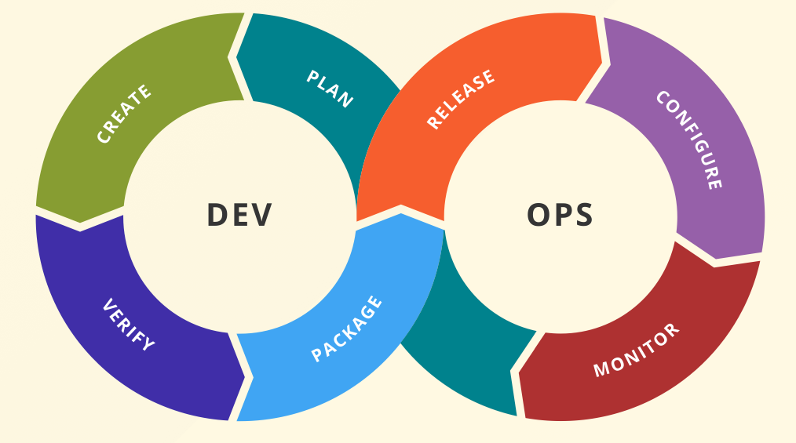

# 👨‍✈️ DevOps

## What is DevOps?

DevOps Elements are Infrastructure as Code, Continuous Delivery, Continuous Integration, Cloud, Automation, Agile Methods and Fast Releases. The DevOps is a combination of Development and Operation, the loop looks like this:

This means that the:

- First iteration defines the following operations
- Permanent monitoring of the process
- Process enhances finetuning
- Pain-Points can directly adjusted
