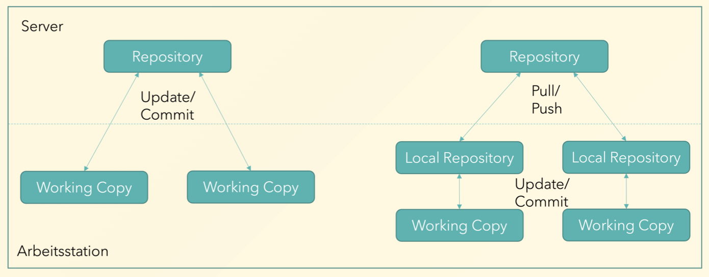

# 🧑🏽‍💻 Version Control

## 🎯 Centralized and Distributed Version Control

There are two approaches to Code Version Control:

## GitHub or GitLab?

## What is Semantic Versioning?

Sematic Versioning is a standard system for versionnumbers. It helps developers to detect changes. The standard:

**Major Version (X.y.z)**

- Significant changes are not backward compatible
- API-changes or new features

**Minor Version (x.Y.z)**

- Backwwards compatibility for new features
- Enhancment or amend of existing features

**Patch Version (x.y.Z)**

- Backwards compatibklity for fixing bugs
- Fix of problems without introduction to new features

## What are Conventional Commits?

**Commit-Structure**

- Format: `<type>(<optional scope>): <description>`
- Example: `feat:(user-auth): add passwort reset functionality`

**Maintypes**

- `feat` for new features
- `fix` for fixing bugs

**Other types**

- `chore` for routine tasks
- `docs` for documentation

Breaking changes are all upper case e.g. `BREAKING CHANGE:`or `feat!:` with the exclamtion mark.
